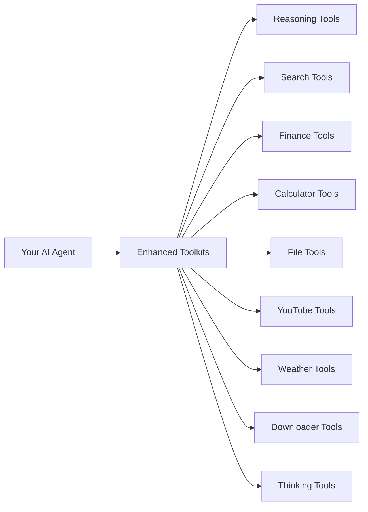

# Getting Started with Enhanced Toolkits

Welcome to Enhanced Toolkits! This guide will help you get up and running with our production-ready AI agent tools.

## What is Enhanced Toolkits?

Enhanced Toolkits is a comprehensive collection of **9 specialized toolkits** designed for AI agents that need reliable, robust, and feature-rich capabilities. Each toolkit includes:

- ✅ **Advanced error handling** and input validation
- ✅ **Caching and rate limiting** for production use
- ✅ **Comprehensive logging** and debugging support
- ✅ **OpenAI compatibility** for seamless integration
- ✅ **Enterprise-grade security** controls

## Quick Overview

## Core Toolkits

| Toolkit | Purpose | Key Features |
|---------|---------|--------------|
| 🧠 **Reasoning Tools** | Multi-modal reasoning with bias detection | 6 reasoning types, session tracking |
| 🔍 **Search Tools** | Web search with content extraction | SearxNG integration, anti-bot bypass |
| 💭 **Thinking Tools** | Structured cognitive frameworks | 8 thinking types, quality assessment |
| 📁 **Files Tools** | Secure file operations | Enterprise security, atomic operations |
| 📈 **Finance Tools** | Stock market and financial data | Real-time prices, company information |
| 🎥 **YouTube Tools** | Video metadata and transcripts | Multi-language support, error handling |
| ☁️ **Weather Tools** | Weather data and forecasts | 30+ languages, flexible location input |
| 📥 **Downloader Tools** | Universal file downloading | Anti-bot bypass, smart content processing |
| 🧮 **Calculator Tools** | Financial and mathematical calculations | 9 specialized calculator modules |

## Next Steps

1. **[Install Enhanced Toolkits](installation.md)** - Get the library installed in your environment
2. **[Quick Start Guide](quick-start.md)** - Your first Enhanced Toolkits program
3. **[Configuration](configuration.md)** - Set up environment variables and options
<!-- 4. **[Environment Variables](environment.md)** - Configure external services -->

## Need Help?

- 📖 Browse the [Core Toolkits documentation](../toolkits/index.md)
- 🧮 Explore [Calculator Modules](../calculators/index.md)
<!-- - 🔧 Learn about [Advanced Features](../advanced/index.md) -->
- 📚 Check the [API Reference](../api/index.md)
- 👨‍💻 Read the [Developer Guide](../developer/index.md)

## Community & Support

- 🐛 [Report Issues](https://github.com/malvavisc0/enhancedtoolkits/issues)
- 💬 [Discussions](https://github.com/malvavisc0/enhancedtoolkits/discussions)
- 📧 [Contact](mailto:support@enhancedtoolkits.dev)

---

Ready to build powerful AI agents? Let's get started! 🚀
