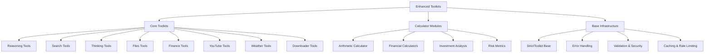

# Enhanced Toolkits

[](./LICENSE)
[](https://www.python.org/downloads/)
[](https://github.com/agno-ai/agno)

**Production-ready AI agent tools for developers building intelligent chatbots and AI systems.**

This collection provides nine comprehensive toolkits designed for AI agents that need reliable, robust, and feature-rich capabilities. Each tool includes advanced error handling, input validation, caching, rate limiting, and comprehensive logging.

## 🚀 Key Features

<div class="feature-list">
  <div class="feature-item">
    <div class="feature-icon">🧠</div>
    <div>
      <strong>Advanced Reasoning</strong><br>
      Multi-modal reasoning with cognitive bias detection
    </div>
  </div>
  <div class="feature-item">
    <div class="feature-icon">🔍</div>
    <div>
      <strong>Intelligent Search</strong><br>
      Web search with content extraction and parsing
    </div>
  </div>
  <div class="feature-item">
    <div class="feature-icon">💭</div>
    <div>
      <strong>Structured Thinking</strong><br>
      Cognitive frameworks with quality assessment
    </div>
  </div>
  <div class="feature-item">
    <div class="feature-icon">📁</div>
    <div>
      <strong>Secure File Operations</strong><br>
      Enterprise-grade file handling with security controls
    </div>
  </div>
  <div class="feature-item">
    <div class="feature-icon">📈</div>
    <div>
      <strong>Financial Data</strong><br>
      Comprehensive stock market and financial information
    </div>
  </div>
  <div class="feature-item">
    <div class="feature-icon">🧮</div>
    <div>
      <strong>Financial Calculator</strong><br>
      Advanced financial calculations and arithmetic operations
    </div>
  </div>
  <div class="feature-item">
    <div class="feature-icon">🎥</div>
    <div>
      <strong>YouTube Integration</strong><br>
      Video metadata and transcript extraction
    </div>
  </div>
  <div class="feature-item">
    <div class="feature-icon">☁️</div>
    <div>
      <strong>Weather Data</strong><br>
      Current conditions and forecasts in multiple languages
    </div>
  </div>
  <div class="feature-item">
    <div class="feature-icon">📥</div>
    <div>
      <strong>Universal Downloader</strong><br>
      Anti-bot bypass with smart content processing
    </div>
  </div>
</div>

!!! success "OpenAI Compatible"
    All toolkits are fully compatible with OpenAI's function calling API and the Agno framework.

## 📦 Quick Installation

```bash
# Install with core dependencies
pip install git+https://github.com/malvavisc0/enhancedtoolkits.git

# Install with all optional dependencies
pip install "enhancedtoolkits[full] @ git+https://github.com/malvavisc0/enhancedtoolkits.git"
```

## 🚀 Quick Start

```python
from enhancedtoolkits import (
    ReasoningTools,
    SearxngTools,
    ThinkingTools,
    FilesTools,
    YFinanceTools,
    YouTubeTools,
    CalculatorTools,
    WeatherTools,
    DownloaderTools
)

# Initialize tools
reasoning_tool = ReasoningTools()
search_tool = SearxngTools(host="http://searxng:8080")
thinking_tool = ThinkingTools()
files_tool = FilesTools()
finance_tool = YFinanceTools()
youtube_tool = YouTubeTools()
calculator_tool = CalculatorTools()
weather_tool = WeatherTools()
downloader_tool = DownloaderTools()

# Use the tools
result = reasoning_tool.reason(
    agent_or_team=agent,
    problem="Analyze market trends",
    reasoning_type="analytical",
    evidence=["Market data shows..."]
)
```

## 🏗️ Architecture Overview



## 📚 Documentation Sections

<div class="toolkit-grid">
  <div class="toolkit-card">
    <h3>🚀 Getting Started</h3>
    <p>Installation, configuration, and your first steps with Enhanced Toolkits.</p>
    <a href="getting-started/">Get Started →</a>
  </div>
  
  <div class="toolkit-card">
    <h3>🔧 Core Toolkits</h3>
    <p>Comprehensive documentation for all 8 core toolkit modules.</p>
    <a href="toolkits/">Explore Toolkits →</a>
  </div>
  
  <div class="toolkit-card">
    <h3>🧮 Calculator Modules</h3>
    <p>Financial and mathematical calculation tools with detailed examples.</p>
    <a href="calculators/">View Calculators →</a>
  </div>
  
  <div class="toolkit-card">
    <h3>⚡ Advanced Features</h3>
    <p>Security, performance, error handling, and session management.</p>
    <a href="advanced/">Advanced Topics →</a>
  </div>
  
  <div class="toolkit-card">
    <h3>📖 API Reference</h3>
    <p>Complete API documentation with method signatures and examples.</p>
    <a href="api/">API Docs →</a>
  </div>
  
  <div class="toolkit-card">
    <h3>👨‍💻 Developer Guide</h3>
    <p>Contributing, testing, and deployment information for developers.</p>
    <a href="developer/">Developer Info →</a>
  </div>
</div>

## 🛡️ Why StrictToolkit?

Enhanced Toolkits uses **StrictToolkit** as its base class to ensure robust and predictable behavior when interacting with AI agents. This approach:

- **Enforces parameter completeness** for reliable tool execution
- **Prevents runtime errors** from missing parameters
- **Improves debugging** with clearer error messages
- **Ensures AI agent compatibility** with consistent interfaces

## 🔧 Requirements

- **Python**: 3.8+
- **Agno Framework**: Latest version
- **Core Dependencies**: `httpx`, `yfinance`, `youtube-transcript-api`
- **Optional Dependencies**: `markitdown`, `pywttr`, `pywttr-models`

## 🤝 Contributing

We welcome contributions! Please see our [Contributing Guidelines](developer/contributing.md) for details.

## 📄 License

This project is licensed under the MIT License - see the [LICENSE](https://github.com/malvavisc0/enhancedtoolkits/blob/main/LICENSE) file for details.

---

**Made with ❤️ for AI agent developers**